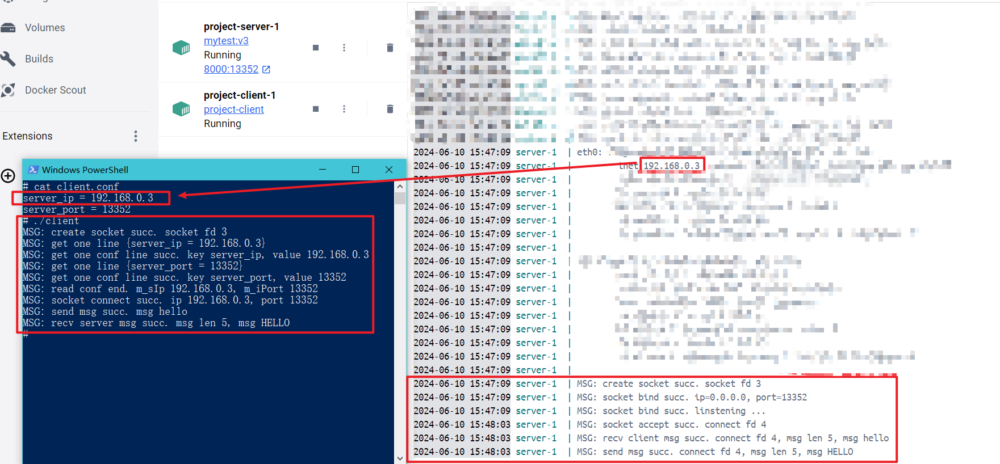

# docker 基础阶段 5

本阶段演示 docker-compose 的作用，就是类似前面一个阶段的多容器通信，但是这个阶段是直接用一个 `docker-compose.yml` 文件来实现的，更方便管理。

直接去到文件夹 `project/` 下，然后运行 `docker-compose up -d`，然后就可以去 `docker desktop` 里面操作 `client` 了，注意根据 `server` 的 `ifconfig` 输出的 `ip` 配置好 `client.conf` 并重启。

下面是成功截图

